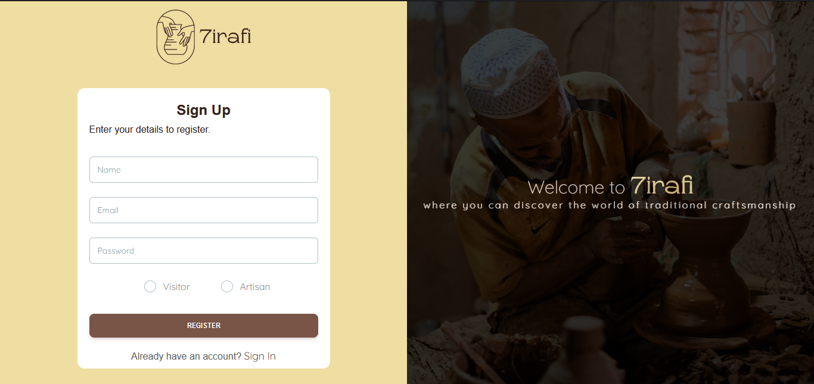
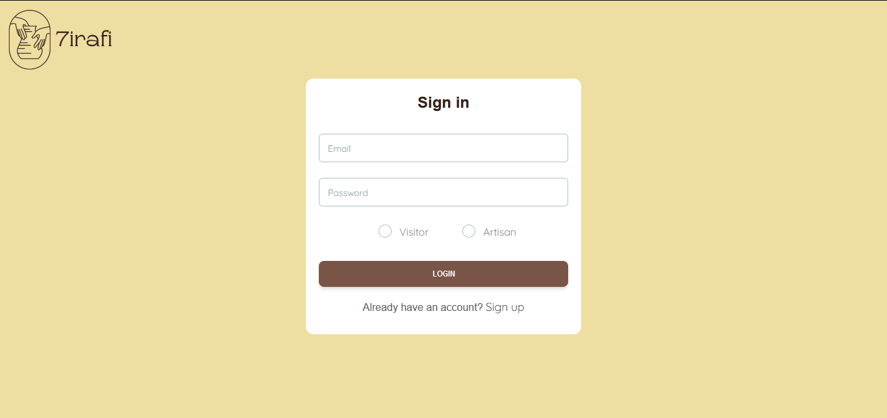

# 7irafi - Online Artisanal Store and E-Learning Platform

7irafi is a comprehensive web-based platform that serves as an online artisanal
store and e-learning platform for artisans. The project aims to provide artisans with
a digital space to showcase and sell their unique handmade products while also
offering educational resources and courses to enhance their craft.


## Tech Stack

**Client:** ***React, TailwindCSS***

**Server:**  ***Node, Express***


## Run Locally

Clone the project

```bash
  git clone https://github.com/younes-jabbour/intership-project.git
```

Go to the client side folder

```bash
  cd client
```

Install dependencies

```bash
  npm install
```

```bash
  npm run start
```

same thing ,go to the api side folder

```bash
  cd api
```

Install dependencies

```bash
  npm install
```
and run it
```bash
  npm run start
```
## progress

- Desning application architecture and Database.


## Register and login pages.

### Register page.



### Login page.



## authentication mechanisme.

to securely register new users (visitors or artisans) in the database, I have opted to hash their passwords using the bcrypt.js library. Additionally, I will generate a ***JWT token*** and send it to the user. JWT is a token that will be frequently passed through the local storage of the client's browser. This token will be utilized in every user request to verify their identity and grant access to the requested resources.